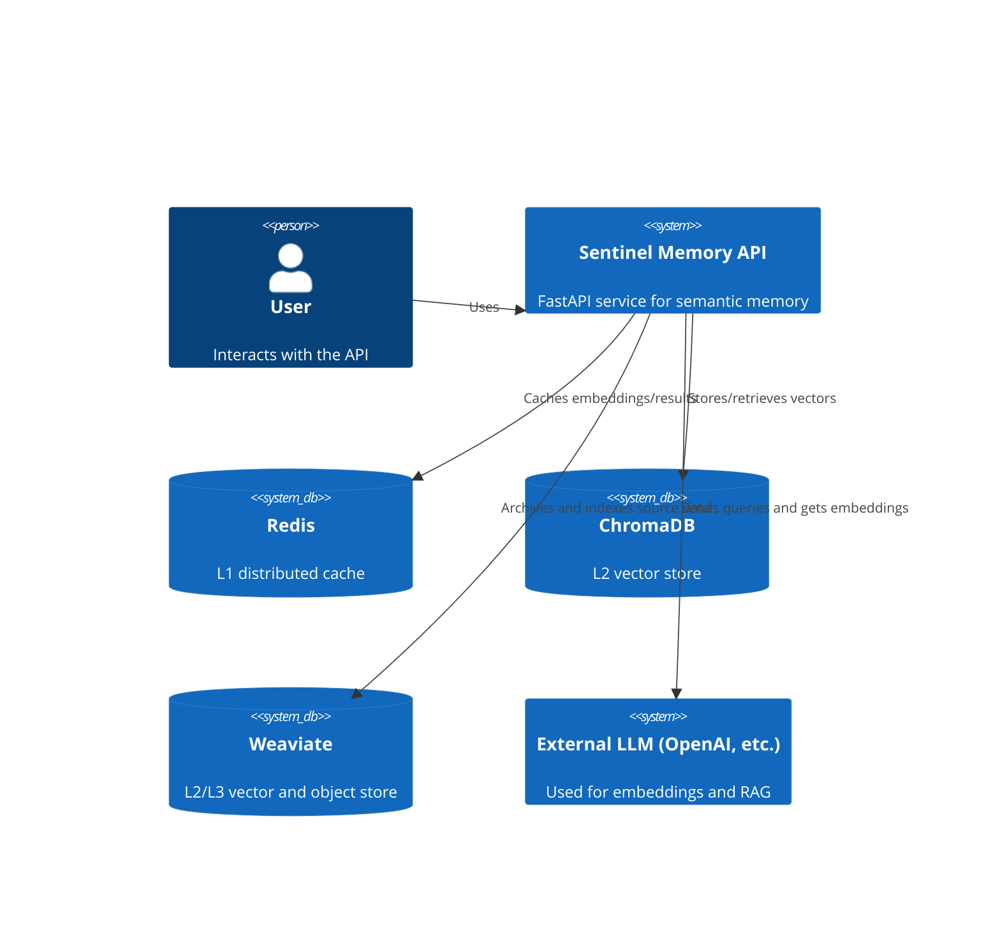

# Architecture Diagram (C4 Model)

```mermaid
C4Context
Person(user, "User", "Interacts with the API")
System(api, "Sentinel Memory API", "FastAPI service for semantic memory")
SystemDb(redis, "Redis", "L1 distributed cache")
SystemDb(chroma, "ChromaDB", "L2 vector store")
SystemDb(weaviate, "Weaviate", "L2/L3 vector and object store")
System(llm, "External LLM (OpenAI, etc.)", "Used for embeddings and RAG")

Rel(user, api, "Uses")
Rel(api, redis, "Caches embeddings/results")
Rel(api, chroma, "Stores/retrieves vectors")
Rel(api, weaviate, "Archives and indexes source data")
Rel(api, llm, "Sends queries and gets embeddings")
```
