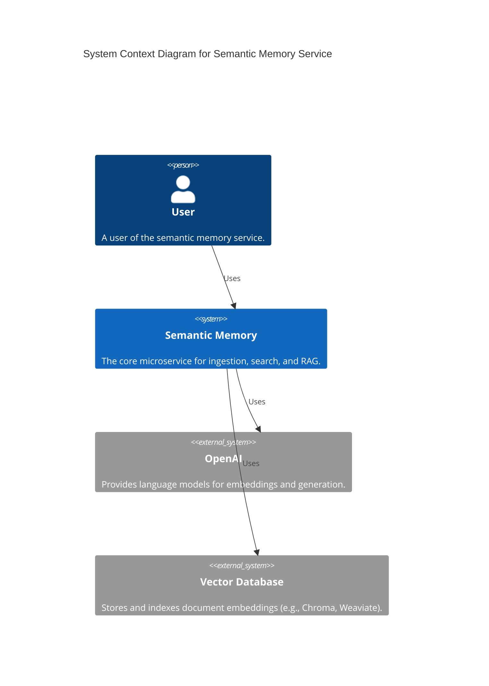

# Architecture

This document provides an overview of the system architecture using the C4 model.

## C4 Diagram

```mermaid
C4Context
  title System Context Diagram for Semantic Memory Service

  Person(user, "User", "A user of the semantic memory service.")
  System(semantic_memory, "Semantic Memory", "The core microservice for ingestion, search, and RAG.")
  System_Ext(openai, "OpenAI", "Provides language models for embeddings and generation.")
  System_Ext(vector_db, "Vector Database", "Stores and indexes document embeddings (e.g., Chroma, Weaviate).")

  Rel(user, semantic_memory, "Uses")
  Rel(semantic_memory, openai, "Uses")
  Rel(semantic_memory, vector_db, "Uses")
```
